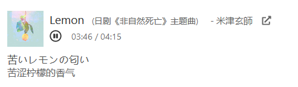

# embedded-netease-music-player
嵌入式网易云音乐播放器 - Embed a netease music player into your web page



复制粘贴下面的 HTML 代码放入页面中，将参数 `536622304` 改为需要播放的音乐 ID 即可。

[Demo](https://dontpanic.blog/about/)

```
<iframe border="0" marginwidth="0" marginheight="0" src="https://dontpanic92.github.io/embedded-netease-music-player/embedded-netease-music-player.html?536622304" width="530" height="96" frameborder="no"></iframe>
```
